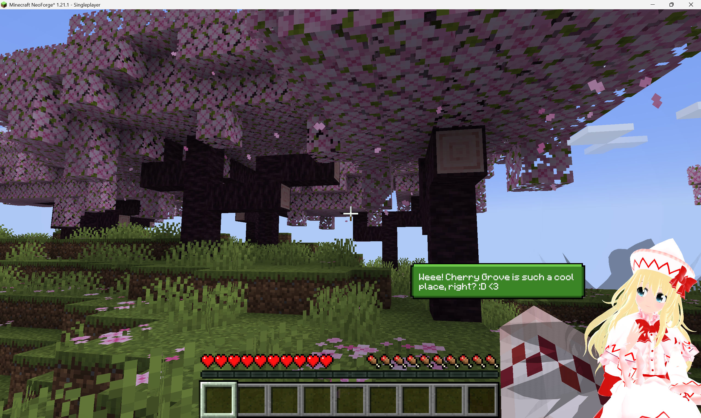
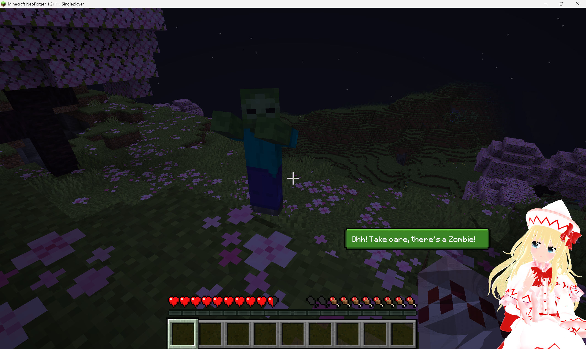
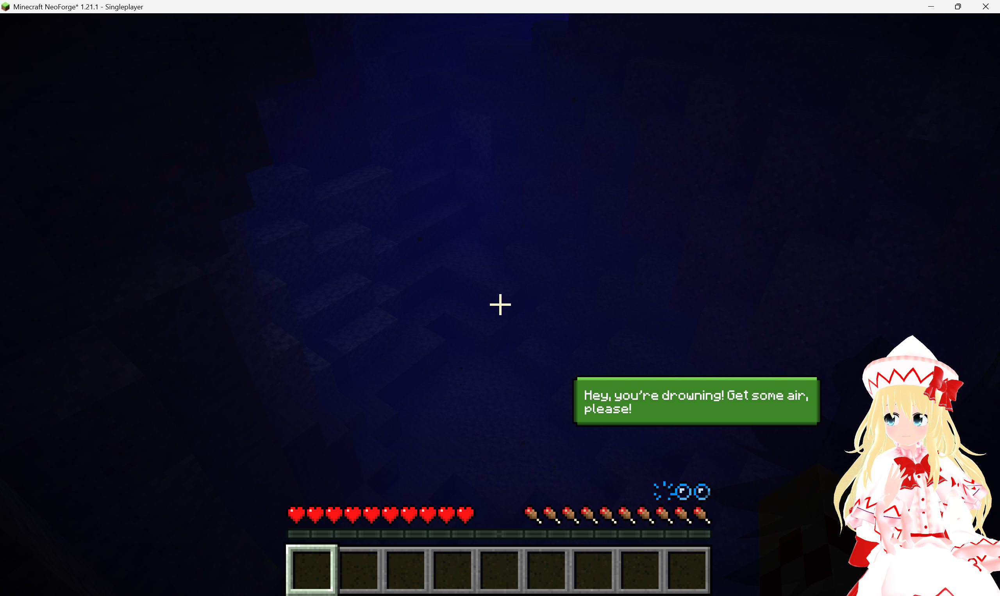

# MateSignal Unofficial

**English** | [简体中文](README.zh-CN.md)

Client-side Minecraft mod that provides cross-interaction with [MateEngine](https://github.com/shinyflvre/Mate-Engine), a 3D desktop avatar application.

The mod observes in-game events and reports them to MateEngine over a local UDP socket. MateEngine renders the corresponding message as a speech bubble on the desktop avatar.

> **Unofficial port.** The original mod supports Minecraft 1.21.10 only. This port
> adds support for 1.20.1, 1.21.1 and 1.12.2. It is not affiliated with or endorsed
> by the MateEngine project or the original author.

---

## Events

The following events produce an avatar message:

| Event | Trigger |
|---|---|
| `time_day` | Daybreak |
| `time_night` | Nightfall |
| `mob_proximity` | A hostile mob enters the configured radius |
| `low_health` | Health drops below the threshold |
| `low_hunger` | Hunger drops below the threshold |
| `drowning` | Air supply becomes critical |
| `death` | Player death |
| `rain_start` | Rain begins |
| `sleep_start` | Player enters a bed |
| `crafted` | An item is crafted |
| `eat` | An item is consumed |
| `kill_confirm` | A mob kill is attributed to the player |
| `biome_discovery` | A biome is entered for the first time |

All three builds emit an identical event set and can address the same MateEngine instance.

Entity and biome names are resolved through the game's language manager, so display
names follow the language selected in Minecraft. No language is assumed by the mod.

---

## Supported versions

| Minecraft | Loader | Java | Artifact |
|---|---|---|---|
| 1.20.1 | Forge 47.x | 17 | `matesignal-forge-1.20.1-1.1.0-1.20.1.jar` |
| 1.21.1 | NeoForge 21.1.x | 21 | `matesignal-neoforge-1.21.1-1.1.0-1.21.1.jar` |
| 1.12.2 | Forge 14.23.5.2860 | 8 | `matesignal-forge-1.12.2-1.1.0-1.12.2.jar` |

For Minecraft 1.21.10, use the [original mod](https://github.com/shinyflvre/Mate-Signal).

---

## Installation

1. Install the loader matching your Minecraft version ([Forge](https://files.minecraftforge.net/) or [NeoForge](https://neoforged.net/)).
2. Place the artifact listed above in `.minecraft/mods`.
3. Start MateEngine.
4. Launch the game.

The mod is client-side only. It has no effect when installed on a server, and the
server does not require it.

---

## Configuration

On 1.20.1 and 1.21.1 the configuration is available in game under **Mods →
MateSignal → Config**, or by editing `config/matesignal-client.toml`.
On 1.12.2 the file is `config/matesignal.cfg`.

Available settings:

- Mob detection radius
- Mob whitelist used by the proximity event
- Per-event toggles for the 13 events listed above

The mod id is `matesignal`, so the configuration file is compatible with the
original mod and settings are preserved when switching between them.

---

## Commands

| Command | Description |
|---|---|
| `/matesignal test all` | Emits all 13 events in sequence, one per second |
| `/matesignal test <event>` | Emits a single event; prefix matching is supported |
| `/matesignal list` | Lists all event names |
| `/matesignal reload` | Reloads the biome name override table (1.12.2 only) |

`/matesignal test all` verifies the connection between the mod and MateEngine. A
sequence of avatar messages indicates a working link. A world does not need to be
loaded; the command is available from the main menu.

---

## Usage restriction

Do not use this mod on public or competitive servers. The avatar reports
information such as nearby hostile mobs, which constitutes cheating under the
rules of some servers.

---

## Troubleshooting

1. **MateEngine is running.** The mod only transmits to localhost; with no
   listener, no messages are produced.
2. **UDP port 32145 is permitted.** The mod sends UDP datagrams to
   `127.0.0.1:32145`. A firewall blocking that port prevents delivery.
3. **`/matesignal test all` produces messages.** If it does, the link is
   functional and the fault is in event detection. If it does not, the link is
   not functional.
4. **Check `logs/latest.log`.** A failed mod load leaves an error there.

---

## Building from source

Requirements: Windows, PowerShell, and the toolchains listed below.

| Target | Gradle | JDK |
|---|---|---|
| 1.20.1 | 8.14.3 | 17 or 21 |
| 1.21.1 | 8.14.3 | 21 |
| 1.12.2 | 4.10.3 | 8 |

```powershell
# Build all three targets; artifacts are written to dist\
.\tools\build-all.ps1

# Build a single target
cd versions\v1_20_1
gradle build
```

The build script locates each toolchain automatically and reports which environment
variable to set if one is missing (`GRADLE_8_HOME`, `GRADLE_LEGACY_HOME`,
`JDK8_HOME`, `JDK21_HOME`). Running `.\setup.ps1` first generates a `gradlew`
wrapper per target.

Repository layout, shared-source organisation, the eight platform divergences, and
the verification procedure are documented in [README-DEV.md](README-DEV.md).

---

## Screenshots

Avatar messages follow the language selected in Minecraft. Both sets below are from
the same build.

**English**



*Biome discovery — the biome name is resolved by the game, not hard-coded.*



*Mob proximity.*



*Drowning.*

**简体中文** — [view the Chinese screenshots](README.zh-CN.md#截图)

---

## Credits

- **Original mod and MateEngine** — Shiny (Johnson Jason)
  - [Mate-Signal](https://github.com/shinyflvre/Mate-Signal)
  - [Mate-Engine](https://github.com/shinyflvre/Mate-Engine)
- **Fabric port**, used as a reference — [VeridonNetzwerk](https://github.com/VeridonNetzwerk/Mate-Signal-Fabric)

The original mod sends the drowning message under the event name `drowning_half`,
which MateEngine does not recognise, so that message was never displayed. This port
corrects it, along with a false nightfall trigger on time jumps, untranslated entity
and biome names, and untranslatable biome names on 1.12.2. The full list is in
[README-DEV.md](README-DEV.md).

---

## License

Distributed under the **MateEngine Pro License v2.0**. The full text is in
[LICENSE.md](LICENSE.md).
