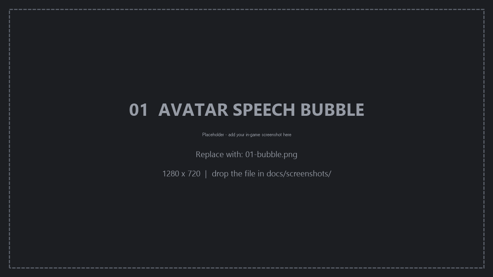
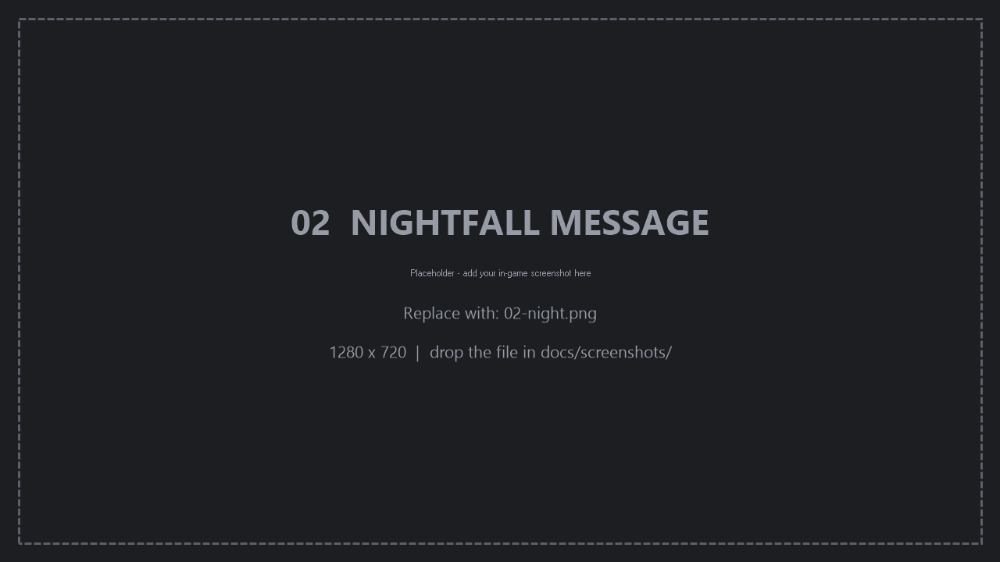
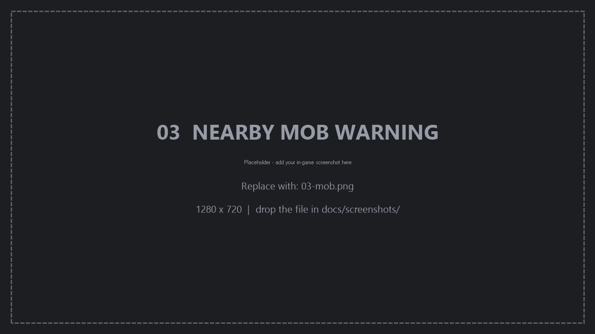
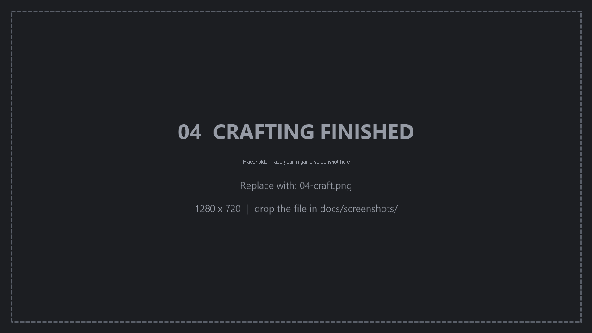

# MateSignal 非官方版

[English](README.md) | **简体中文**

面向 Minecraft 的客户端模组，用于与 3D 桌面宠物应用 [MateEngine](https://github.com/shinyflvre/Mate-Engine) 联动。

模组监听游戏内事件，通过本机 UDP 套接字上报给 MateEngine，由 MateEngine 在桌面角色上渲染对应的气泡文本。

> **非官方移植版。** 原模组仅支持 Minecraft 1.21.10。本移植版新增对 1.20.1、1.21.1
> 和 1.12.2 的支持。与 MateEngine 项目及原作者无隶属或背书关系。

---

## 事件

以下事件会触发角色消息：

| 事件 | 触发条件 |
|---|---|
| `time_day` | 天亮 |
| `time_night` | 天黑 |
| `mob_proximity` | 敌对生物进入配置的检测半径 |
| `low_health` | 生命值低于阈值 |
| `low_hunger` | 饱食度低于阈值 |
| `drowning` | 氧气值进入危险区间 |
| `death` | 玩家死亡 |
| `rain_start` | 开始下雨 |
| `sleep_start` | 玩家上床 |
| `crafted` | 完成一次合成 |
| `eat` | 食用物品 |
| `kill_confirm` | 击杀判定归属于玩家 |
| `biome_discovery` | 首次进入某个群系 |

三个构建产物发出完全相同的事件集合，可指向同一个 MateEngine 实例。

实体名与群系名通过游戏的语言管理器解析，显示名称跟随 Minecraft 内选择的语言。
模组本身不假定任何语言。

---

## 支持的版本

| Minecraft | 加载器 | Java | 产物 |
|---|---|---|---|
| 1.20.1 | Forge 47.x | 17 | `matesignal-forge-1.20.1-1.1.0-1.20.1.jar` |
| 1.21.1 | NeoForge 21.1.x | 21 | `matesignal-neoforge-1.21.1-1.1.0-1.21.1.jar` |
| 1.12.2 | Forge 14.23.5.2860 | 8 | `matesignal-forge-1.12.2-1.1.0-1.12.2.jar` |

Minecraft 1.21.10 请使用[原模组](https://github.com/shinyflvre/Mate-Signal)。

---

## 安装

1. 安装与 Minecraft 版本对应的加载器（[Forge](https://files.minecraftforge.net/) 或 [NeoForge](https://neoforged.net/)）。
2. 将上表对应的产物放入 `.minecraft/mods`。
3. 启动 MateEngine。
4. 启动游戏。

模组为纯客户端实现。安装在服务端不产生任何效果，服务端也无需安装。

---

## 配置

1.20.1 与 1.21.1 可在游戏内 **模组列表 → MateSignal → 配置** 中修改，或直接编辑
`config/matesignal-client.toml`。1.12.2 对应文件为 `config/matesignal.cfg`。

可配置项：

- 生物检测半径
- 触发邻近事件的生物白名单
- 上述 13 个事件的独立开关

模组 ID 为 `matesignal`，配置文件与原模组兼容，两者互换时设置得以保留。

---

## 命令

| 命令 | 说明 |
|---|---|
| `/matesignal test all` | 依次发出全部 13 个事件，每秒一个 |
| `/matesignal test <事件名>` | 发出指定事件，支持前缀匹配 |
| `/matesignal list` | 列出全部事件名 |
| `/matesignal reload` | 重新载入群系名覆盖表（仅 1.12.2） |

`/matesignal test all` 用于验证模组与 MateEngine 之间的连接。出现连续的角色消息即表示
链路正常。无需进入世界，主菜单即可执行。

---

## 使用限制

请勿在公开或竞技服务器使用本模组。角色会播报附近敌对生物等信息，在部分服务器的规则下
构成作弊。

---

## 故障排查

1. **确认 MateEngine 正在运行。** 模组仅向本机发送数据，无接收端时不会产生任何消息。
2. **确认 UDP 32145 端口未被拦截。** 模组向 `127.0.0.1:32145` 发送 UDP 数据报，防火墙
   拦截该端口会导致数据无法送达。
3. **执行 `/matesignal test all`。** 若能产生消息，说明链路正常，问题出在事件检测；若不能，
   说明链路本身不通。
4. **查看 `logs/latest.log`。** 模组加载失败会在其中留下错误记录。

---

## 从源码构建

环境要求：Windows、PowerShell，以及下表所列工具链。

| 目标 | Gradle | JDK |
|---|---|---|
| 1.20.1 | 8.14.3 | 17 或 21 |
| 1.21.1 | 8.14.3 | 21 |
| 1.12.2 | 4.10.3 | 8 |

```powershell
# 构建全部三个目标，产物输出到 dist\
.\tools\build-all.ps1

# 构建单个目标
cd versions\v1_20_1
gradle build
```

构建脚本会自动定位各工具链，缺失时会提示需要设置的环境变量
（`GRADLE_8_HOME`、`GRADLE_LEGACY_HOME`、`JDK8_HOME`、`JDK21_HOME`）。先执行
`.\setup.ps1` 可为每个目标生成 `gradlew` 包装器。

仓库结构、共享源码的组织方式、8 处平台差异以及校验流程见 [README-DEV.md](README-DEV.md)。

---

## 截图









---

## 致谢

- **原模组与 MateEngine** —— Shiny（Johnson Jason）
  - [Mate-Signal](https://github.com/shinyflvre/Mate-Signal)
  - [Mate-Engine](https://github.com/shinyflvre/Mate-Engine)
- **Fabric 移植版**，本移植的参考 —— [VeridonNetzwerk](https://github.com/VeridonNetzwerk/Mate-Signal-Fabric)

原模组的缺氧提示使用事件名 `drowning_half`，而 MateEngine 不识别该名称，因此该提示从未
显示。本移植版修正了这一点，同时修正了时间跳变误判天黑、实体名与群系名未翻译，以及
1.12.2 群系名无法翻译的问题。完整列表见 [README-DEV.md](README-DEV.md)。

---

## 许可证

以 **MateEngine Pro License v2.0** 分发，全文见 [LICENSE.md](LICENSE.md)。
